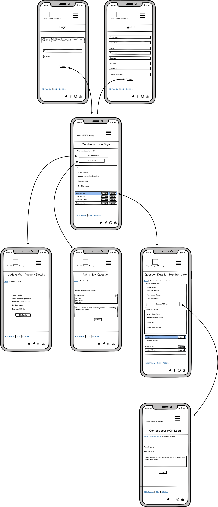
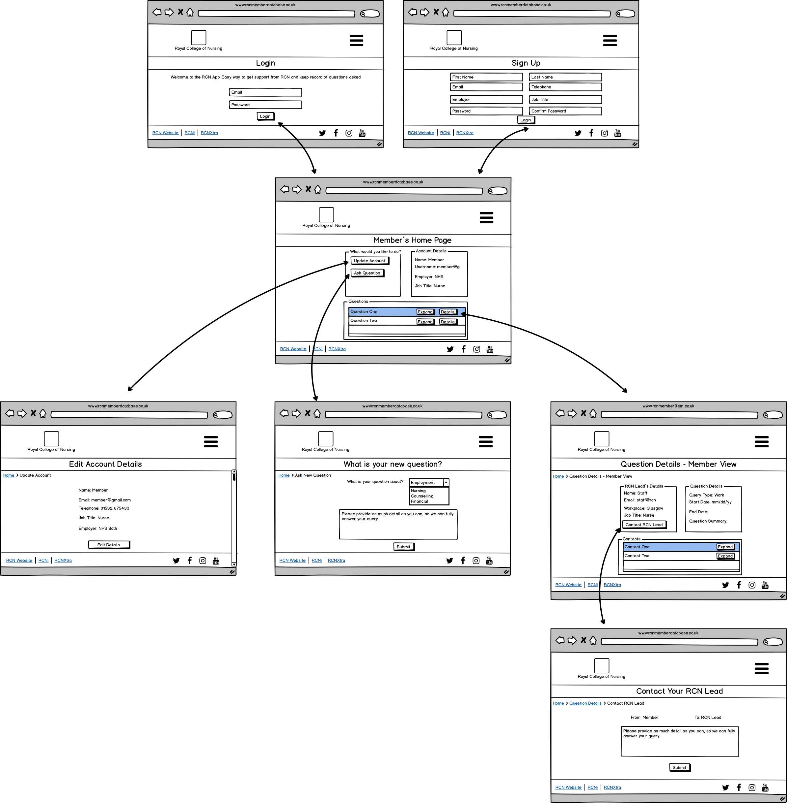
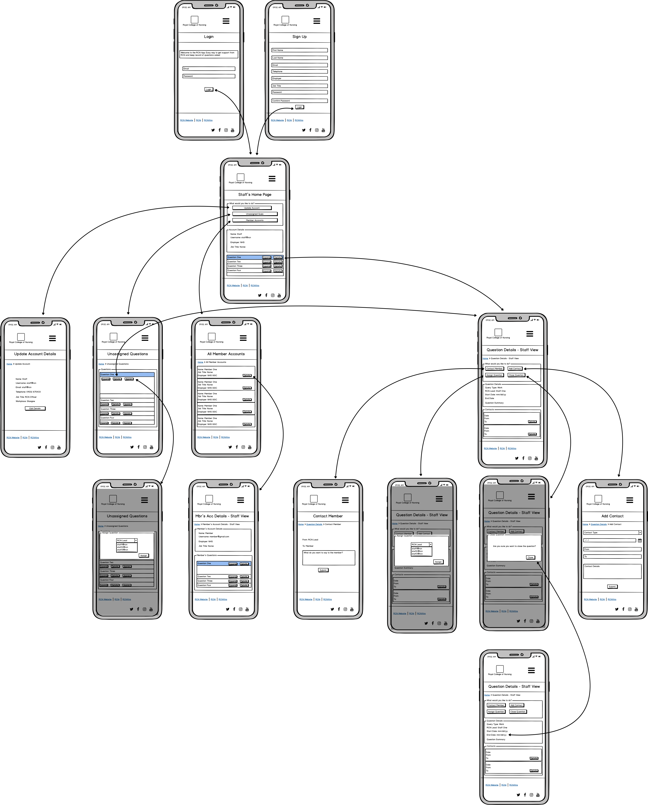
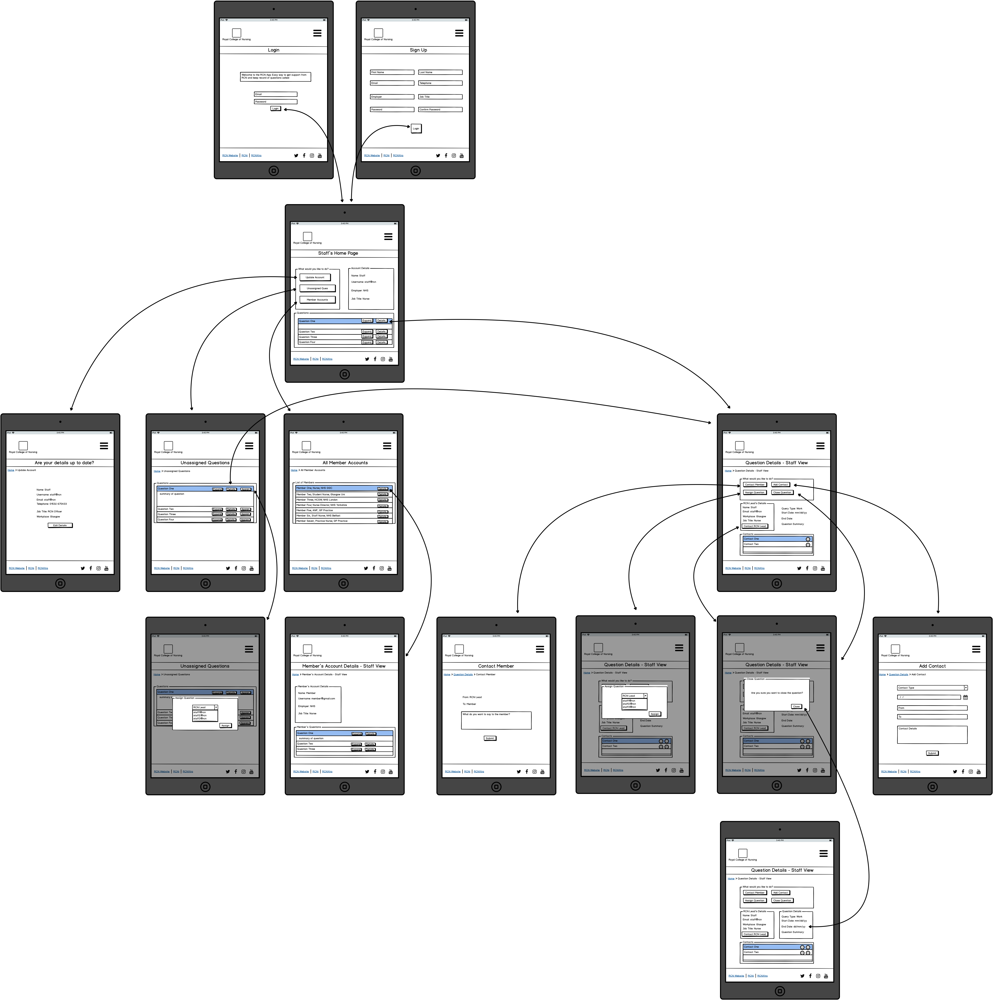
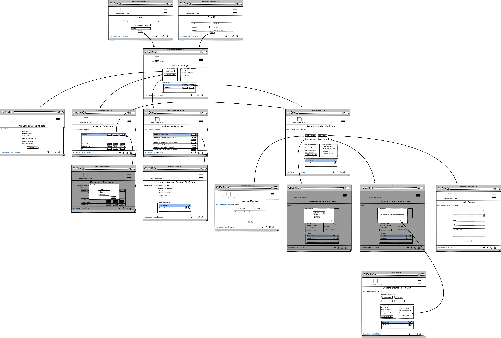
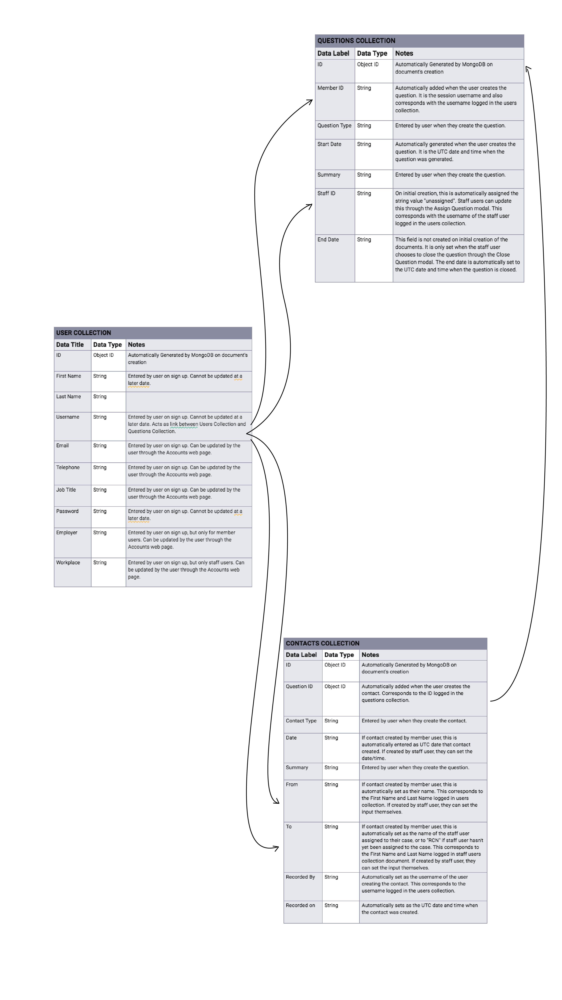

<h1 align="center">
    <a href="https://h4rp3rk.github.io/milestone3_rcn/" target="_blank"></a>
</h1>

<div align="center">

# The Royal College of Nursing Member Query Database

[Open in GitHub](https://github.com/H4RP3RK/milestone3_rcn)

</div>

The Royal College of Nursing (RCN) is a professional body and trade union for nursing staff in the UK. It is a membership organisation that provides advice and support on workplace and professional nursing issues. 
The RCN Member Query Database is a website/app created with the primary goal of improving communication and transparency between RCN staff and RCN members. It is intended to be used by both RCN members and RCN staff.

The website/app has a number of features, some of which are only accessible to particular user groups. For all users, there is a login and registration page, a home page with details of the user's account details and the ability to edit these account details.
RCN members are also able to ask a question using an online form and access details of the questions they have asked, including the RCN staff leading on the question response. The member can add additional contacts onto the question, if they would like to add follow up questions/comments.
RCN staff can also add contacts onto questions members have created. RCN staff have additional accessability to see all questions asked by any member, assign the question to themselves or other staff and close the question. They are also able to see a list of all RCN members, their account details and questions they have asked.

The client requested this website to address issues with current methods of communication with its members. Up until now, RCN members have mainly used phone or email to contact the RCN. RCN staff would then respond by phone, email or, in some cases, a face-to-face meeting would be arranged. Member queries can differ in complexity. 
Some matters can be resolved with only one response but more complicated matters could require ongoing correspondence for many weeks or months. It may also require the RCN contacting third parties on behalf of the member. RCN staff are responsible for keeping a record of all interactions with members and third parties on an internal database. 
This database can be viewed by RCN staff but not by RCN members. It is expected that RCN members keep their own records of their ongoing cases or simply remember the information provided to them.
This leaves room for misunderstandings and misinterpretation of information in what can often be complicated and high stakes matters. In order to reduce this risk, RCN staff are encouraged to follow up telephone calls and face-to-face meetings with an email that confirms the advice given and actions agreed. This approach is followed sporadically by RCN staff.

The client goals for this new website/app are to:
* Improve communication and transparency between RCN staff and RCN members.
* Enhance the member experience in the hope of recruiting and retaining more members.
* Mitigate the organisation against misinterpretation of advice.
* Reduce the duplication of work and use of emails by RCN staff.
* Increase the consistency of record keeping.

The user goals for the new website/app are to:
* Easily seek advice and support from the RCN.
* Ensure that queries and advice are fully understood by both parties.
* Keep a record of previous advice that can be readily accessed at a later date.
* Track the progress of long-running cases.
* Reduce the need for email correspondence.

---

## User experience

### Target Audience

There are two target audiences for the RCN app - RCN members and RCN staff 

RCN members are:
* Nursing staff or nursing students.
* Practicing or studying in the UK.
* Ranging in age from 18 to 70 years old.
* In need of advice or support with a workplace or professional nursing issue.

RCN staff are:
* Employed by the RCN.
* May also be trained nurses.
* Ranging in age from 18 to 70 years old.
* Trained in the use of IT systems and databases.

### User Journey

An RCN member is expected to use the website/app in the following way:
1. Go to the website/app to write and submit their question.
2. The question is logged on member's home page.
3. The member can check the question details, including the details of the RCN Lead for their question, the response to their question and/or any work the RCN Lead has undertaken to resolve their question.
4. The member can choose to ask follow up questions by adding a new contact to their question.
5. Details of questions they have asked are logged on their home page, so can be consulted again at a later date.

An RCN staff member is expected to use the website/app in the following way:
1. Check the website/app for questions that have been asked by RCN members.
2. Assign questions to themself or the most appropriate RCN staff.
3. Questions assigned to the user are logged on the staff member's home page.
4. Respond to the question by adding a contact under the question details.
5. Log any additional contacts with third parties as a contact on the question, so the member is aware of the contact and can read the details.
6. Once the question has been answered, close the question.
7. All member accounts are listed so all staff can see member's accounts and their question details.

### User Aim 

RCN members visit this website/app because they want to:
* Ask for advice and support from the RCN.
* Remind themselves of previous advice given to them by the RCN.
* Check the progress of their ongoing case.

RCN staff use the database because they want to:
* Respond to a member's query in writing.
* Record a telephone or face-to-face meeting with the member or third party.
* Check back on the details of a member's case.

This website/app helps the users achieve these goals by providing:
* An easily accessible way for RCN members to get in touch with the RCN.
* An intuitive form of record keeping for both RCN staff and RCN members.
* A place to store previous RCN advice and information.
* A regularly updated log of ongoing cases.

### User Stories

1. As a new visitor to the site, I want to sign up so I can get access to the site's features.
2. As an existing user of the site, I want to update my account details.
3. As a member, I want to use the site to ask the RCN a question.
4. As a member, I would like to check the progress of my ongoing question.
5. As a member, I would like to ask a follow up question to my existing question.
6. As a member, I want to check the contact details of my RCN Lead so I can phone them.
7. As a member, I want to check back on a question I previously asked.
8. As staff, I want an way for me and my colleagues to see the outstanding workload (ie unassigned questions). 
9. As staff, I want to be able to organise the workload by assigning questions to myself or colleagues.
10. As staff, I would like an easy way to monitor my workload and close completed questions.
11. As staff, I want an efficient way to simultaneously keep my own records and update the member.
12. As staff, I would like an easy way to browse search through our members.

### Wireframes
Arrows indicate the navigation between the site pages.

#### Member Journey
##### Small Screens


##### Medium Screens


##### Large Screens


#### Staff Journey
##### Small Screens


##### Medium Screens


##### Large Screens


---
## Features 
Every page has a consistent layout and design, which features:
* Headers and footers coloured blue and white, in line with the RCN brand.
* The RCN logo is in the top left corner of the header, in keeping with the layout of existing [RCN websites](https://www.rcn.org.uk/).
* The logo also doubles as a link back to the user's home page, if logged in, or the login page.
* A drop down navigation menu is used to minimise clutter on the page. The navigation menu differs, dependent on whether the user is a member or staff.
* There is a banner across each page with a title that clearly explains the page's purpose.
* The footer features links to related sites and their associated logos. On the left side of the footer there are the RCN sites; [RCN Website](https://www.rcn.org.uk/), [RCNi](https://rcni.com/) and [RCNXtra](https://my.rcn.org.uk/RCNXtra/login).
* On the right hand side of the footer, there are links to the RCN's social media sites; [Twitter](https://twitter.com/theRCN), [Facebook](https://www.facebook.com/index.php?next=https%3A%2F%2Fwww.facebook.com%2Froyalcollegeofnursing), [Instgram](https://www.instagram.com/thercn/) and [YouTube](https://www.youtube.com/user/RCNonline)
* Breadcrumbs are used throughout the website to map the site layout and allow for easy navigation back and forth through the webpages.
* Flash messages are used throughout the website to confirm successful user actions or alert the user to errors.
* Different background images are used on each page. These are both aesthetically pleasing and help to differentiate each page. The images are layered with white opacity to ensure that they are not distracting to the main content of the page. All images are taken from the RCN's existing website.
* Consistent and simple styling of rounded border boxes breaks each web page's information into easily digestible chunks.
* A responsive grid design ensures that the content is organised in an aesthetically pleasing and practical format on all screen sizes.

### Login
The website is intended only for RCN members and RCN staff. There is no functionality for those who do not login, therefore, the website opens on the login page to make this clear to the visitor.
A strap line is used to easily explain the purpose of the website to the user. A link is provided to the Sign Up page for those who do not yet have login details. A danger flash message appears if the wrong username/password combination is entered.

### Sign Up
The sign up page includes a tab which switches between the member and staff sign up forms. A flask form is used for the form functionality. Error messages highlight incompatible inputs for each form section and a flash message is also used to highlight errors, such as the email address is already registered.
There is a link to the log in page for those who have already signed up. If the form is succesfully submitted, the user is redirected to their personalised home page and a flash message appears to confirm that an account has successfully been created for the user.

### User's Home Page 
The user's home page can differ dependent upon whether the user is a member or staff. The overall look is similar. The page is split into three sections. Responsive grids display these sections in a single column in smaller screens. On larger screens, one row has two equally sized sections side by side and there is a second row that is the full length of the container.
#### Member View
Section one asks the member what they would like to do and offers three options in the form of buttons
* update account details - takes the user to a separate page (details below)
* ask new question - takes the user to a separate page (details below)
* see current/closed questions - scrolls the screen down to the last section of the page.

Section two outlines the member's account details. It provides the member's name, username, email address, telephone number, employer and job title. 

Section three lists the questions that the member has submitted. These are displayed using Bootstrap accordion so each question can be expanded to show a summary of the question asked. The accordion header also provides a link to a separate page that gives more detail about the question.
Questions are listed in order of start date, with those asked most recently at the top. Closed questions drop to the bottom of the list.

#### Staff View
Section one also asks the staff user questions and provides accompanying buttons. They are
* update account details
* see assigned questions
* browse unassigned questions
* see all member accounts.

Section two also provides the user's account details. Instead of stating the employer, the staff user's account shows their workplace. 

Section three provides details of all the questions assigned to the staff user. Again, they are listed by start date, with most recent at the top. Closed questions drop to the bottom of the list. The accordion
expands to provide a summary of the question and there's a link to take the user to full details of the question.

### Account 
Allows the user to update their account details. The form is prepopulated by the user's existing account details. All inputs except the username can be altered. The username is greyed out to make this apparent to the user.
Responsive grid design shows the labels and inputs in one full width column on smaller screens. On larger screens the form is centred in the screen and labels and inputs are shown side by side. This aids with readability.
When the user submits the form, they are redirected back to their home page and a flash message confirms that the update has been successful. Breadcrumbs are provided incase the user wishes to direct back to the home page without
making any updates.

### Ask New Question - Members Only 
This page is available for members only, to allow them to submit a question to be answered by an RCN staff member. A simple form allows the member to easily submit their question. A select box allows them to choose the question type that most suits their question and
a free text box allows them to ask their question. The form is consistent with the responsive grid layout described in the form above.

A placeholder message encourages them to provide as much detail as possible. The breadcrumbs allows the member to direct back to the home page without submitting a question. On submission, the member is redirected back to
their home page and a flash message confirms that the question has been submitted. It also reminds the member that they can check on the "Questions" section of their home page for details of the question they have just submitted.

### Member Question Details - Members Only 
This page is available for members only as staff see a different view of the question details. Members can direct to this page from their home page once they have submitted a question. 

The page has a similar layout to the home page - three sections that have the same responsive layout that changes dependent on the size of the screen. Section one provides the RCN Lead's contact details. If an RCN Lead hasn't yet been assigned, it provides general RCN contact details. It also 
provides a button that allows the member to contact their RCN Lead. This is logged as a contact on the question.

Section two provides detail of the question, including the question type, start date, end date (which remains blank if the question is open) and the question summary.

Section three provides all contacts associated with the question. This could be further contacts made by the member or contacts logged by the RCN Lead. The contacts are displayed in a similar format to the questions on the home page. They are listed in date order, most recent at the top. Bootstrap accordions are used. 
On expansion, contact details are provided. For those contacts that are made by the member, an edit button appears to allow them to make changes to their contact.

### Staff Question Details - Staff Only 
This page is available for staff only. It provides details of the question the member has asked and provides the staff user with a number of options for actions that can be taken. 

Responsive grid design is used for the layout of the page. It is broken into four sections for readbility. In smaller screens, these sections are displayed in one column. On larger screens, section one is full width of the container, section two and three are equal width side by side and column four is full width. 
The overall layout is similar to the home page and member question details page, in order to ensure consistency and ease of use for the user. 

Section one displays at the top of the page and asks the staff what they would like to do, and provide corresponding buttons. Options are:
* Contact member - this leads to the contact form section below.
* Add contact - leads to a new page
* Assign question - displays a modal that allows staff with a one question form that allows them to choose to whom to assign the question. This could be the user or a colleague. 
* Browse contacts - scrolls the page to section four, where the contacts are listed 
* Close/reopen question - this button differs dependent on whether the question is open or closed. If open, a modal appears to ask the staff user if they are sure they wish to close the question and provides a close button. If the button is pressed, the modal closes and the question details of the page is updated with an end date. The end date is the date that the close button is pressed. If the question is already closed, the reopen button simply removes the end date from the question details section.

Section two of the page provides the question details and is the same as the question details described in the Member Question Details page above. Section three provides the member's account details. 
Section four lists the contacts related to the question in the same way described in the Member Question Details page above. 

### Contact Form 
This page is accessible to both members and staff, although accessed in a different way for each group of users. Members can access this through the "Contact your RCN Lead" button on their home page, described above. 
The page consists of a simple form, that has the same responsive grid format as those forms described above. The form has two greyed out readonly inputs; from and to. From is always the website user. For members, the "To" input will either state the RCN Lead or, if the RCN Lead hasn't yet been assigned, simply the RCN.
For staff, the "To" section will state the member who submitted the overarching question. 

Breadcrumbs allow the user to return to their home page or details of the overarching question without submitting a contact.

### Detailed Contact Form - Staff Only 
This page provides a more detailed contact form that allows staff to log all contacts they have had in relation to the question. The page contains a form that uses the same responsive grid design that is described for forms above. The staff user is given a select option as to the type of contact eg this app, email, telephone, in person etc. 
The date of the contact is prepopulated with the current date and time but this can be overwritten by the user. The "From" section is prepopulated by the user's name but can also be overwritten. The "To" section and "Contact Details" are free text to allow the user to complete these details. 
On submit, the user is redirected back to the Staff Question Details page and a flash message confirms that the contact has been logged. The contact should also appear on the question details page. If the user chooses not to submit a contact, they can redirect back to their home page, unassigned questions page or question details page using the breadcrumbs. 

### Unassigned Questions - Staff Only 
This page is accessible only to staff. It provides a list of all questions that have not yet been assigned to an RCN Lead. The questions are listed using the Bootstrap accordion, to remain consistent with the rest of the site. The accordion header describes the question type and the date the question was asked. There are also three buttons:
* Summary button - allows the accordion to be expanded to show the details of the question without the need to navigate to a new page.
* Details button - directs the user to the Staff Question Details page for the associated question
* Assign question button - a modal appears that allows the question to be assigned to the user or a colleague without the need to navigate from the page 

### All Member Accounts - Staff Only 
This page is accessible only to staff. It provides a list of all the members accounts. The layout is very similar to the unassigned questions page to ensure good user experience. However, the expandable accordion was not considered necessary for this list as all pertinent information can be included in the header. Members are listed in alphabetical order (in accordance with their surname).
A search bar allows the user to search by name, job title or employer. For each member, a button is provided that leads the user to further details. 

### Member Details - Staff Only 
This page is accessible only to staff. It provides details of each member account. The layout is very similar to the user home page and question details pages. Section one provides the member's account details and section two provides details of all questions the member has asked. The accordion format is used to display the questions. A button allow each accordion to be expanded to show the question details. 
Another button leads to the Staff Question Details page for the associated question. This allows staff users to see all questions, even those who are assigned to another staff user.

### Existing Features 
* Header Logo - on every page. Acts as a navigation link back to the user's home page (or login page, if not logged in).
* Navigation Bar - on every page, with different content dependent on whether user is member or staff. Allows users to easily identify the website pages and navigate to the area of their choosing.
* Banner - on every page. Acts as a title to clearly show the purpose of the page.
* Breadcrumbs - on most pages. Allows the user to easily navigate between pages and outlines the layout of the site. 
* Footer Links - on every page. Identifies related sites and provides accessible links to each.
* Forms - Flask Forms are used extensively throughout the site for login, registration, account updates, questions and contacts.
* Search Bar - on All Member Accounts page. Allows user to search through the list by member name, employer or job title. 
* Accordions - used extensively through the site in order to provide easily accessible information on the one page without cluttering the layout. 
* Modals - used throughout the site to allow actions to be taken without navigating the user away from the necessary page.

### Features Left to Implement 
* Functionality to reset the user password and change the username. As authentication was not the focus of this project, it was not considered a priority.
* A Date Time Picker on the Detailed Contact Form page. A Date Picker had initially been used but later removed due to lack of functionality on certain web browsers.
* Upload files. Could be added in future to allow both members and staff to upload related documents to the member's question. 
* Add user photos. This could help to build rapport between members and their RCN Leads.

---
## Data 
A NoSQL database was used for this project, as were the requirements of the course. Relationships were structured between the three different three different collections;
users, questions and contacts. The information structure and relationships are displayed below. 



---

## Technologies Used 

* [Gitpod](https://www.gitpod.io/)
* [Github](https://github.com/) - version control and storage of the project
* [Heroku](https://dashboard.heroku.com/) - for deployment of the completed website
* HTML and CSS 
* Javascript - used for the search function for the All Member Accounts page, Scroll buttons on the Question Details and Home pages.
* [MongoDB](https://www.mongodb.com/) - A NoSQL database used to store project data.
* [PyMongo](https://pymongo.readthedocs.io/en/stable/#) - for writing Python code that would be compatible with Mongo DB.
* [Jinja](https://jinja.palletsprojects.com/en/2.11.x/) - Python templating language used throughout the HTML files.
* [Flask](https://flask.palletsprojects.com/en/1.1.x/) - Web framework used to construct the web pages.
* [JQuery](https://jquery.com/) - Javascript library user for the navbar and accordions.
* [Bootstrap](https://getbootstrap.com/) - for the responsive grid layout, navbar, modals and forms. All templates were tailored to the needs of the site. 
* [Google Fonts](https://fonts.google.com/) - used to style the website fonts. PT Sans as the closest match to the current RCN branding.
* [Font Awesome](https://fontawesome.com/) - icons for certain buttons.

---

## Testing 
Testing details can be found here in [testing.md](testing.md)

---
## Deployment 

To deploy this page to GitHub Pages from its [GitHub repository](https://github.com/H4RP3RK/milestone_2_rpoas), the following steps were taken: 

1. From the menu items near the top of the page, select **Settings**.
2. Scroll down to the **GitHub Pages** section.
3. Under **Source** click the drop-down menu labelled **None** and select **Master Branch**
4. On selecting Master Branch the page is automatically refreshed, the website is now deployed. 
5. Scroll back down to the **GitHub Pages** section to retrieve the link to the deployed website.
 
### How to run this project locally

To clone this project from GitHub:

1. In order to download, you will require a local IDE, Python, MongoDB, PIP and Git installed.
2. From the [GitHub repository](https://github.com/H4RP3RK/milestone3_rcn), click on the green "Code" button, which gives the option to download the ZIP file.
3. Download the ZIP file
4. In the Clone with HTTPs section, copy the clone URL for the repository. 
5. In your local IDE open Git Bash.
5. Change the current working directory to the location where you want the cloned directory to be made.
6. Type ```git clone```, and then paste the URL you copied in Step 3.
```console
git clone https://github.com/H4RP3RK/milestone3_rcn.git
```
7. Install all the modules outlined in requirements.txt.
8. Create your own SECRET_KEY and MONGO_URI to link with your own MONGO_DB database. The database should be name rcndatabase, with three collections; users, questions and contacts.

Further reading and troubleshooting on cloning a repository from GitHub [here](https://help.github.com/en/articles/cloning-a-repository).

### Heroku Deployment 

1. Create a requirements.txt file and a Procfile.
2. Create a new app on your Heroku account.
3. Git push your project to Heroku.
4. Set your SECRET_KEY, MONGO_URI, IP and PORT config variables on your Heroku account.
5. Deploy from your Heroku dashboard.

---
## Credits 

* The background images are existing RCN promotional photos.
* The website tutorials consulted in the creation of the project are credited throughout the code comments.

### Acknowledgements 
* Thanks to my mentor, Jonathan Munz, for his guidance.
* Thanks to the Slack Community for always being so supportive and generous with their time.
* Thanks to the Code Institute tutors for their patience with me.
* Thanks to my employer, RCN, for the inspiration for this project.