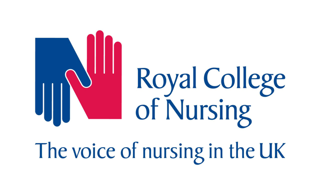

<h1 align="center">
    <a href="https://h4rp3rk.github.io/milestone3_rcn/" target="_blank"></a>
</h1>

<div align="center">

# The Royal College of Nursing Member Query Database

[Open in GitHub](https://github.com/H4RP3RK/milestone3_rcn)

</div>

The Royal College of Nursing (RCN) is a professional body and trade union for nursing staff in the UK. It is a membership organisation that provides advice and support on workplace and professional nursing issues. 
The RCN Member Query Database is a website/app created with the primary goal of improving communication and transparency between RCN staff and RCN members.

The website/app features...

The client requested this website to address issues with current methods of communication with its members. Up until now, RCN members have mainly used phone or email to contact the RCN. RCN staff would then respond by phone, email or, in some cases, a face-to-face meeting would be arranged.

Member queries can differ greatly. Some matters can be resolved with only one response but more complicated matters could require ongoing correspondence for many weeks or months. It may also require the RCN contacting third parties on behalf of the member. 

RCN staff are responsible for keeping a record of all interactions with members and third parties on an internal database. This database can be viewed by RCN staff but not by RCN members. It is expected that RCN members keep their own records of their ongoing cases or simply remember the information provided to them.
This leaves room for misunderstandings and misinterpretation of information in what can often be complicated and high stakes matters. In order to reduce this risk, RCN staff are encouraged to follow up telephone calls and face-to-face meetings with an email that confirms the advice given and actions agreed. This approach is followed sporadically by RCN staff.

The client goals for this new website/app are to:
* Improve communication and transparency between RCN staff and RCN members.
* Enhance the member experience in the hope of recruiting and retaining more members.
* Mitigate the organisation against misinterpretation of advice.
* Reduce the duplication of work and use of emails by RCN staff.
* Increase the consistency of record keeping.

The user goals for the new website/app are to:
* Easily seek advice and support from the RCN.
* Ensure that queries and advice are fully understood by both parties.
* Keep a record of previous advice that can be readily accessed at a later date.
* Track the progress of long-running cases.
* Reduce the need for email correspondence.

---

## User experience

### Target Audience

The primary audience for the RCN Member Query Database are:
* RCN members.
* Nursing staff or nursing students.
* Practicing or studying in the UK.
* In need of advice or support with a workplace or professional nursing issue.

A secondary audience to consider are RCN staff who provides the advice and support to the RCN member.
They will be required to update the database with their advice.

### User Journey

An RCN member is expected to use the website/app in the following way:
1. They encounter a workplace or professional nursing issue.
2. They go to the website/app to write and submit their query.
3. They receive a response to their query from the appropriate RCN department.
4. They can choose to ask further questions by writing and submitting through the website/app or close their query.
5. Their question and response is logged on their app, which allows them to read it at a later date, if they wish.
6. If their case requires further investigation, they can keep updated with third party involvement through the database.

An RCN staff member is expected to use the website/app in the following way:
1. They receive a notification that a query has been asked by a member through the website/app.
2. They provide a response to the query through the Member Query Database. 
3. This database can be read by other RCN staff and the individual member so there is no need to keep a record of this contact anywhere else.
4. If a member case requires further telephone conversations, face-to-face meetings or communication with third parties, these are all logged on the Member Query Database.

### User Aim 

RCN members visit this website/app because they want to:
* Ask for advice and support from the RCN.
* Remind themselves of previous advice given to them by the RCN.
* Check the progress of their ongoing case.

RCN staff use the database because they want to:
* Respond to a member's query in writing.
* Record a telephone or face-to-face meeting with the member or third party.
* Check back on the details of a member's case.

This website/app helps the users achieve these goals by providing:
* An easily accessible way for RCN members to get in touch with the RCN.
* An intuitive form of record keeping for both RCN staff and RCN members.
* A place to store previous RCN advice and information.
* A regularly updated log of ongoing cases.

### User Stories

### Wireframes

---
## Features 

### Existing Features 

### Features Left to Implement 


---

## Technologies Used 

* [Gitpod](https://www.gitpod.io/)
* [Github](https://github.com/)
* HTML and CSS 

---

## Testing 

### Tools 

### User Testing 

### User Feedback

### Problem Solving 

---
## Deployment 

To deploy this page to GitHub Pages from its [GitHub repository](https://github.com/H4RP3RK/milestone_2_rpoas), the following steps were taken: 

1. From the menu items near the top of the page, select **Settings**.
2. Scroll down to the **GitHub Pages** section.
3. Under **Source** click the drop-down menu labelled **None** and select **Master Branch**
4. On selecting Master Branch the page is automatically refreshed, the website is now deployed. 
5. Scroll back down to the **GitHub Pages** section to retrieve the link to the deployed website.
 
### How to run this project locally

To clone this project from GitHub:

1. Under the repository name, click "Clone or download".
2. In the Clone with HTTPs section, copy the clone URL for the repository. 
3. In your local IDE open Git Bash.
4. Change the current working directory to the location where you want the cloned directory to be made.
5. Type ```git clone```, and then paste the URL you copied in Step 3.
```console
git clone https://github.com/H4RP3RK/milestone3_rcn.git
```
6. Press Enter. Your local clone will be created.

Further reading and troubleshooting on cloning a repository from GitHub [here](https://help.github.com/en/articles/cloning-a-repository).

---
## Credits 

### Content

### Media 

### Code 

### Acknowledgements 

******MY OWN NOTES - NOT PART OF FINAL README******

## To Do
* Create view so staff can see all members and search through them 


## Questions/To Do

Jonathan 08.09.2020
- Read up on flask forms documentation
- Change all to forms
x Combine different methods to one, particularly Login
- Can have multiple base.html and pull from it to create staff/member views
- Avoid duplication of else in methods, means it can be reduced down
- JS - organise the questions by date etc or close btn on flash messages

Base.html
    x restyle navbar dropdown
    - Change dropdown options for staff
Welcome.html
    x If session exists, take to member_home rather than log_in
Login.html
    - link up forgot password
Register.html
    x If user exists with email address, can you send error?
Queries.html 
    x Need to show RCN Lead Name rather than RCN Lead ID
    x How do I set up so tables link with each other? 
    x Why is logo image not showing?
New_question.html
    x Why won't labels go blue?
New_contact.html
    x How do I timestamp contact? - default=datetime.utcnow
    x Edit contact
    x If mbr adds new contact, remove end_date
    x If staff, redirect to staff question view
Home.html
    x scroll to questions
    x highlight question section when button pressed
    x Reorder accordion so latest come to the top
    x change datetime to better format
    x all member account btn
    - In staff view, remove case from view once closed
    - In member view, show end date 
Account.html
    x make sure update works
    x Change to show workplace if staff
    x change form to flask form 
    - warning message when changing account details
    - Change staff job_title to select
Unassigned_questions.html
    x Why won't staff pull through to modal?
Question_details.html
    x Link contacts to particular query
    x Restyle accordion
    x scroll to contacts
    x highlight contacts section when button pressed
    x change datetime to better format
    x If RCN staff unassigned, add a message with general contact details
    x Show details of RCN staff dealing with query
    - Show photo of RCN staff 
    - Add edit contacts btn, only on contacts created by user
    x Reorder accordion so latest come to the top
    - If no contacts, add a generic message (Why is this not working?)
    x add close btn if case open
    x add reopen btn if case closed
    - Upload file
    - Only edit your own contacts
    - Change date format
    - Check that showing in order, once date format corrected
Staff_question_details.html
    - Changed time format to match other Pages
    x Change workplace to employer in member details
    x link up close question 
    x Add edit contacts btn, only on contacts created by user
    x Add top/bottom margins to btns
    x Alter member question layout - form?
    - Fit form inputs within border
    - Change accordion forms to font awesome to match member_list page
    - Open two accordions at one time
Member_list.html
    - Add JS to filter different queries and/or search
App.py 
    x set up environ to protect password before pushing
    - Can the members.queries.find_one be simplified so it's not duplicated
    - Can one @app.route send to two tables? Want to send to query and contact?
    - Why is secret key not working when in env.py?
    - simplify duplication of else methods. Use and with member and password

## Mandatory Requirements
A project violating any of these requirements will FAIL

- Data handling: Build a MongoDB-backed Flask project for a web application that allows users to store and manipulate data records about a particular domain. If you are considering using a different database, please discuss that with your mentor first and inform Student Care.
- Database structure: Put some effort into designing a database structure well-suited for your domain. Make sure to put some thought into the nesting relationships between records of different entities.
- User functionality: Create functionality for users to create, locate, display, edit and delete records (CRUD functionality).
- Use of technologies: Use HTML and custom CSS for the website's front-end.
- Structure: Incorporate a main navigation menu and structured layout (you might want to use Materialize or Bootstrap to accomplish this).
- Documentation: Write a README.md file for your project that explains what the project does and the value that it provides to its users.
- Version control: Use Git & GitHub for version control.
- Attribution: Maintain clear separation between code written by you and code from external sources (e.g. libraries or tutorials). Attribute any code from external sources to its source via comments above the code and (for larger dependencies) in the README.
- Deployment: Deploy the final version of your code to a hosting platform such as Heroku.
- Make sure to not include any passwords or secret keys in the project repository.
- Important Notes - No authentication is expected for this project. The focus is on the data, rather than any business logic.

## Assessment Criteria
Your Data Centric Development project will be assessed based on the following criteria:

* Usability and Visual Impact:
    - Project Purpose
    - UX design
    - Suitability for purpose
    - Navigation
    - Ease of use
    - Information Architecture
    - Defensive Design
* Layout and Visual Impact:
    - Responsive Design
    - Image Presentation
    - Colour scheme and typography
* Code Quality:
    - Appropriate use of HTML
    - Appropriate use of CSS
    - Appropriate use of JavaScript
    - Appropriate use of Python
    - Appropriate use of the template language
* Software Development practices:
    - Directory Structure and File Naming
    - Version control
    - Testing implementation
    - Testing write-up
    - Readme file
    - Comments
    - Data store integration
    - Deployment implementation
    - Deployment write-up